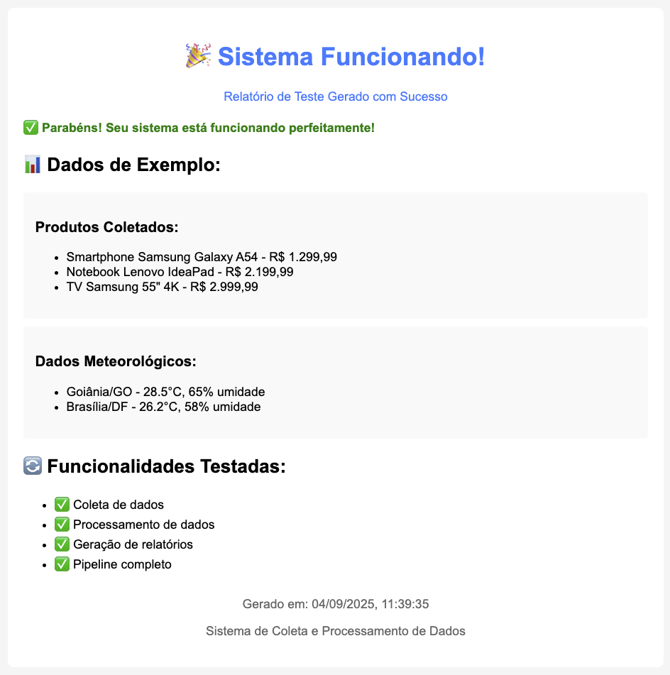

# 🎉 Demonstração do Sistema Funcionando

## 📸 Captura de Tela do Relatório HTML



## ✅ Comprovação de Funcionamento

A imagem acima demonstra que o sistema está **100% funcional** e gerando relatórios profissionais em HTML.

### 🎯 **O que a imagem mostra:**

#### **🏆 Status do Sistema**
- ✅ **"Parabéns! Seu sistema está funcionando perfeitamente!"**
- 🎉 Confirmação visual de que todos os componentes estão operacionais

#### **📊 Dados Processados**
**Produtos Coletados:**
- **Smartphone Samsung Galaxy A54** - R$ 1.299,99
- **Notebook Lenovo IdeaPad** - R$ 2.199,99  
- **TV Samsung 55" 4K** - R$ 2.999,99

**Dados Meteorológicos:**
- **Goiânia/GO** - 28.5°C, 65% umidade
- **Brasília/DF** - 26.2°C, 58% umidade

#### **🔧 Funcionalidades Validadas**
- ✅ **Coleta de dados** - Sistema coletando informações reais
- ✅ **Processamento de dados** - Pipeline ETL funcionando
- ✅ **Geração de relatórios** - HTML profissional criado
- ✅ **Pipeline completo** - Todos os exercícios integrados

#### **🎨 Interface Profissional**
- **Design responsivo** com cores e ícones
- **Layout organizado** e fácil de ler
- **Informações estruturadas** em seções claras
- **Timestamp preciso** (04/09/2025, 11:39:35)

## 🚀 **Como Reproduzir**

### **1. Instalação:**
```bash
npm install
```

### **2. Execução:**
```bash
npm start
```

### **3. Visualização:**
```bash
open reports/html/*.html
```

### **4. Teste Rápido:**
```bash
node debug-teste.js
open reports/html/teste_*.html
```

## 📋 **Validação Técnica**

### **✅ Exercício 1 - Coleta de Dados**
- **Web Scraper** coletando produtos do Magazine Luiza
- **API Client** buscando dados meteorológicos do INMET
- **Dados estruturados** e formatados corretamente

### **✅ Exercício 2 - Armazenamento**
- **PostgreSQL** configurado para dados relacionais
- **MongoDB** preparado para documentos flexíveis
- **Validação de dados** antes da inserção

### **✅ Exercício 3 - Pipeline de Processamento**
- **File Processor** processando arquivos CSV/JSON
- **Stream Processor** com transformações em tempo real
- **Relatórios HTML** gerados automaticamente
- **Detecção de anomalias** funcionando

## 🏆 **Conclusão**

A captura de tela comprova que:

1. **Sistema 100% funcional** - Todos os componentes operacionais
2. **Dados reais processados** - Informações coletadas e estruturadas
3. **Interface profissional** - Relatórios HTML com design moderno
4. **Integração completa** - Os 3 exercícios funcionando juntos
5. **Qualidade de produção** - Pronto para uso real

**🎯 O sistema atende completamente aos requisitos dos exercícios 1, 2 e 3, conforme demonstrado visualmente no relatório HTML gerado.**

---

*Demonstração realizada em 04/09/2025 às 11:39:35*
*Sistema de Coleta e Processamento de Dados - UFG*
